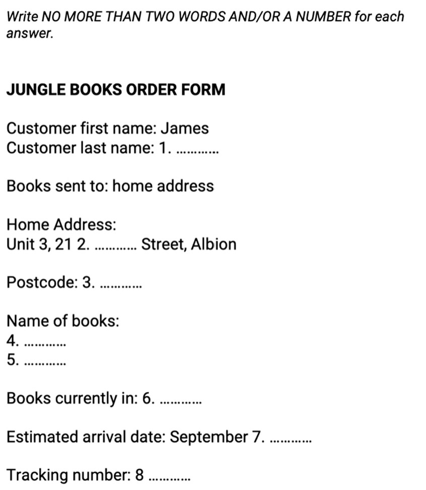

## Listening 

- 30 minutes
- 40 Questions
- 4 Sections
- 5 Question Types

**Sections**

- Section 1: Two people conversing in a social setting.
- Section 2: One Person talking in a social setting (speech, the ranger talking about the rules etc).
- Section 3: 2-3 people conversing in an educational setting.
- Section 4: One person speaking in an academic setting.

**Section Pointers**

- Vocabulary goes up with sections
- Recording heard only ONCE
- Range of Accents delivered
- **Listen for**
	* Main Ideas
	* Detailed Info
	* Opinions
	* Attitudes
	* Purpose of whats being said
	* Development of Ideas

## Question Types

- **Note, Form, Table, Flow Chart Completion**

